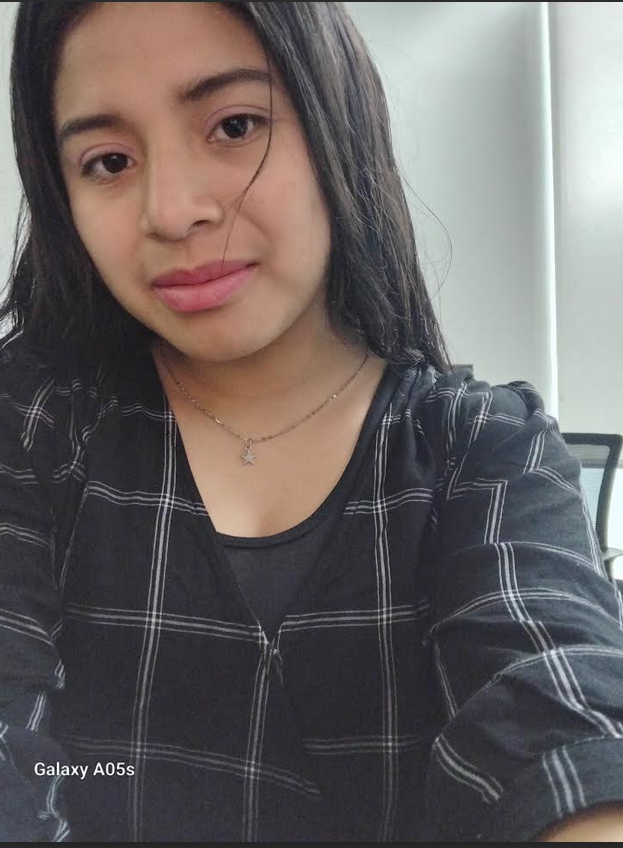

# HOLA ME LLAMO IRMA 
## ESTUDIO PYTHON
### SOY ESTUDIANTE ME ESFUERZO CADA DIA PARA APRENDER COSAS NUEVAS , PARA ENCONTRARME EN EL MUNDO DE MLA TECNOLOGIA ,ASI MISMO PARA PODER CREAR MI PROPIA PAGINA WEB.

## ME APACIONA ENTENER COMO FUNCIONAN LAS COSAS, DISFRUTO EL PROCESO DE ENCONTTRAR SOLUCIONES CREATIVOS Y PROBLEMAS LOGICOS.

## MIS CONOCIMIENTOS ESTA BASADO EN:
1. PYTHON
2. GITHUB
3. HTML

## MI META ES PODER DESARROLLAR MIS HABILIDADES EN EL TEMA DE LA PROGRAMACION Y SER UNA INGENIERA EN SISTEMAS.

### POR MEDIO DE TODOS MIS CONOCIMIENTOS CREAR/PROYECTAR MI PROPIA EMPRESA 

#### AUMENTAR MIS CONOCIMIENTOS EN LA PROGRAMACION PERO EN UN HAMBITO ELECTRONICO.
